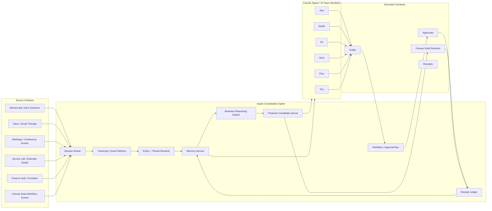

# 01 — Architecture and Rules

## Objective

Establish the system topology, ownership boundaries, and hard rules for syncing Aspire agents and product surfaces.

## Architecture summary

## Domain truth ownership

### Company-finance truth
Owner: Finance Hub  
Includes:
- bank/balance/transaction/provider state
- accounting truth rails
- invoice/payment/payroll/tax continuity where finance-owned
- finance provider freshness and queue state

### Project/job planning truth
Owner: Service Lab  
Includes:
- project budgets
- package budgets
- staffing strategy
- subcontract strategy
- equipment/rental strategy
- project margin floor / safer-path / best-path / bigger-bet

### Technical estimate truth
Owner: Estimate Studio  
Includes:
- visual/evidence intake
- plans/photos/specs
- takeoff assumptions
- package pricing assumptions
- estimate options
- RFI/submittal drafting and status when estimate-owned

### Workflow execution truth
Owner: Canvas Desk  
Includes:
- approvals
- blockers
- reminders
- follow-ups
- routines
- execution transitions

### Continuity/context truth
Owner: Office Memory + Finance Memory  
Includes:
- thread summaries
- handoff notes
- pending intents
- authority context
- brief summaries
- memory-linked receipts
- cross-domain context references

## Hard rules

1. No surface may silently claim another surface's truth.
2. No agent may own a separate memory architecture.
3. Every consequential action must be approval-gated or explicitly risk-tiered green.
4. Every state-changing action must emit a receipt.
5. Canvas Desk receives workflow triggers only.
6. Pattern intelligence is an export/output layer, not a primary write target.
7. Raw transcripts are secondary evidence, not the default reasoning surface.
8. All write operations are server-governed. No client-side tool execution.
9. Tenant isolation and deny-by-default access are mandatory.
10. All contracts are append-only friendly and replayable.

## Execution states

Every action-like object in Aspire must map to one of these states:

- `requested`
- `drafted`
- `pending_approval`
- `approved`
- `executed`
- `rejected`
- `superseded`
- `failed`
- `promoted` (for durable memory promotion)

## Cross-cutting controls

### Identity controls
- tenant-scoped IDs
- suite and office scoping
- actor and agent provenance
- capability-token checks for tools

### Safety controls
- deny by default
- correlation IDs
- idempotency keys
- retries with backoff for safe operations
- dead-letter strategy for failed webhook/event processing
- structured errors
- PII redaction at refinery boundaries where appropriate

### Observability controls
- event trace IDs
- workflow trace IDs
- session IDs
- memory write metrics
- approval latency metrics
- receipt integrity checks
